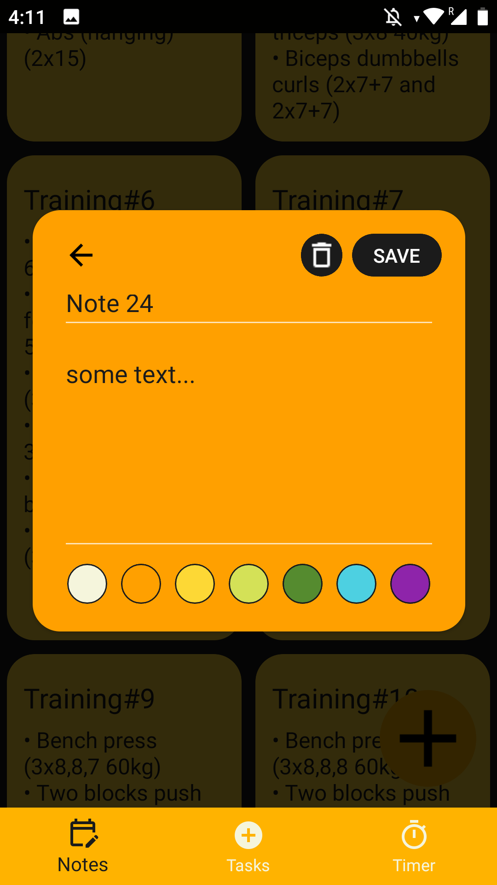
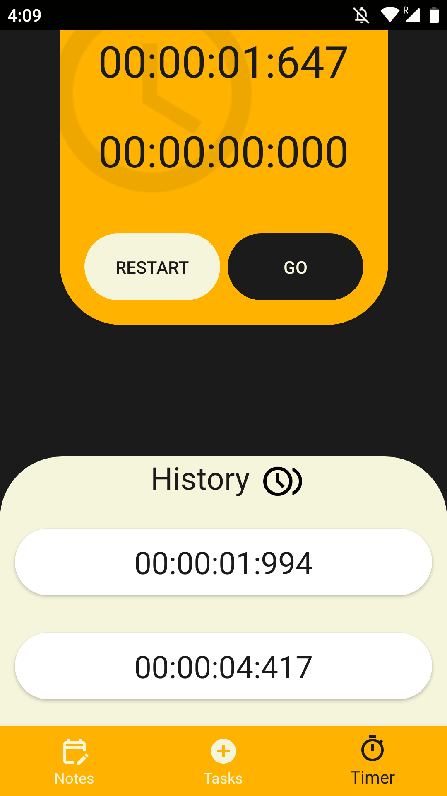
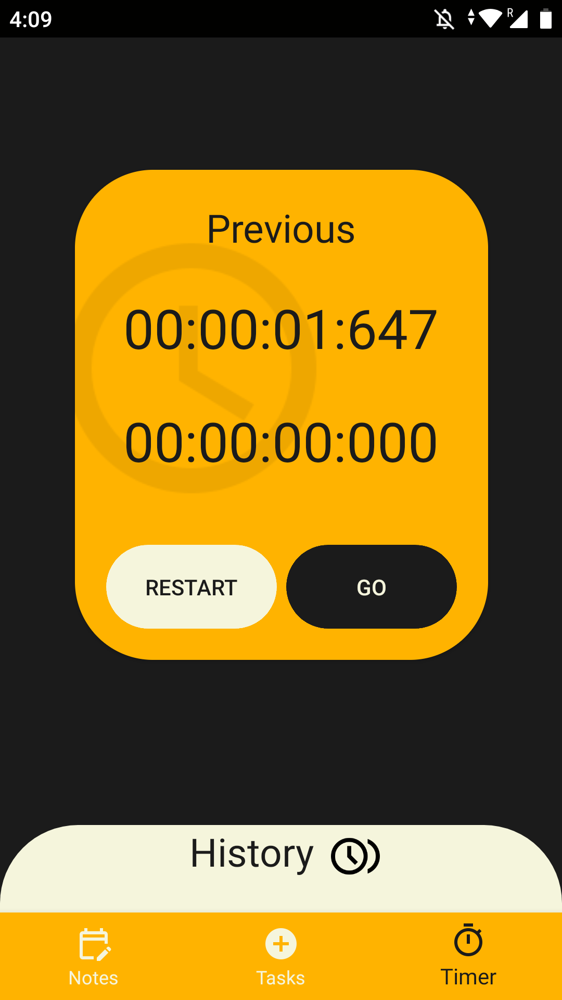

# Spark

Spark is a personal productivity application that introduces a unique perspective on time management, complemented by integrated note-taking and timer tools. The app’s timeline view is centered around the concept that time moves forward nonstop—and it’s up to you how wisely you choose to use it.

Spark is a cross-platform app developed for Android and iOS using **.NET C# and XAML** in **Xamarin .NET MAUI**. It utilizes **Google Material Design 3** for a modern visual appearance and **SQLite** for local data storage on the user’s device. The app has been fully tested and is currently operational on the Android system; several features may need some further improvements.

## Making notes 

## Timer  

  
  

| Image 1 | Image 2 |
|--------|--------|
|   |   |

## Features
- 🚀 Fast and efficient performance
- 🔧 Easy configuration and setup
- 📡 REST API integration
- 🎨 User-friendly UI/UX
- 🔄 Automated workflows

